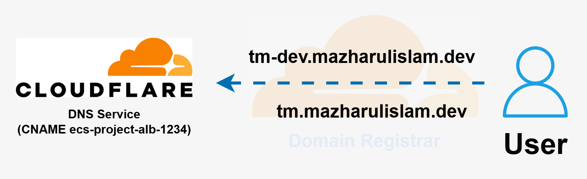

# Intro

This is documentation for the ECS-Forge repo - it contains docs related to all the code set up for this project.

## Table of Contents
<!-- TABLE OF CONTENTS -->
<details>
  <summary>Table of Contents</summary>
  <ol>
    <li>
      <a href="#traffic-flow-explained">Traffic flow explained</a>
      <ul>
        <li><a href="#access-to-website">Access to website</a></li>
        <li><a href="#load-balancer-and-remaining">Load balancer and remaining</a></li>
      </ul>
    </li>
    <li>
      <a href="#technology-stack-explained">Technology stack explained</a>
      <ul>
        <li><a href="#infrastructure-as-code-tools">Infrastructure-as-code tools</a></li>
          <ul>
          <li><a href="#terraform">Terraform</a></li>
          <li><a href="#terragrunt">Terragrunt</a></li>
          <li><a href="#aws-services-used">AWS services used</a></li>
          </ul>
      </ul>
        <li><a href="#project-structure">Project structure</a></li>
    </li>
  </ol>
</details>


[Dockerfile, LICENSE, README.md, and App](https://github.com/Mazharul419/ECS-Forge/edit/main/documentation/README.md#dockerfile-license-readmemd)
&nbsp;<br>
[]()
<br>
[]()


# Traffic Flow Explained

## Access to website




To access the live application in production environment, the user types in ***tm.mazharulislam.dev***(or ***tm-dev.mazharulislam.dev*** if accessing development environment).

A DNS (Domain Name System) query takes place - the client sends out tm.mazharulislam.dev and receives the IP address of the public-facing Application Load Balancer (ALB) allowing it to connect to the application hosted in AWS.


[image - Notes](https://app.capacities.io/842d982e-dafe-4919-b038-f1da4582566c/8756b937-d7ab-48cd-8576-1f2925e75a22)


Assuming there is no cache stored at any stage - [the following](https://www.cloudflare.com/en-gb/learning/dns/what-is-dns/) will happen:

1. User types in "tm.mazharulislam.dev" - the client checks locally to see if the IP address is cached - within it's browser, or the OS

2. The query travels into the Internet and is received by a DNS resolver

3. The root server responds with the address of a Top Level Domain (TLD) DNS server .dev

4. The resolver then makes a request to the TLD server carrying .dev domain which responds with the IP address of the domain’s nameserver mazharulislam.dev

5. The resolver sends a query to the domain’s nameserver - since a subdomain **tm** is present there is an [additional nameserver](https://www.cloudflare.com/en-gb/learning/dns/what-is-dns/) which holds the CNAME record

6. The [CNAME](https://developers.cloudflare.com/dns/manage-dns-records/reference/dns-record-types/) is mapped to the Application Load Balancer (ALB) DNS name which is returned to the resolver from the nameserver

7. The authoritative name server responds to the DNS resolver with the CNAME record which includes the DNS name of the load balancer*

8. This record is forwarded to the client

9. Client makes a new query for the ALB CNAME

10. The resolver forwards to amazonaws.com domain where the A record is hosted

11. A record containing the [IP addresses of the ALB nodes](https://docs.aws.amazon.com/elasticloadbalancing/latest/application/application-load-balancers.html) is returned to DNS resolver

12. DNS resolver finally returns the IP address of the ALB, allowing the client to send a HTTP request in order to connect to the code-server application


*If the apex zone mazharulislam.dev was used instead (by replacing **tm** with **@**), Cloudflare can return the ALB IP address via a process called [CNAME flattening](https://developers.cloudflare.com/dns/cname-flattening/)(see also [Flattening diagram](https://developers.cloudflare.com/dns/cname-flattening/cname-flattening-diagram/))


# Load Balancer and remaining

Use this section to explain flow from ALB to tasks in private subnet

Also explain how applications can access AWS services privately

---


# Technology Stack Explained

## Infrastructure as Code Tools

## Terraform

## Terragrunt

## AWS Services Used

# Project Structure

## Overview

```
.
├── Dockerfile
├── LICENSE
├── README.md
├── app
├── architecture
│   └── decisions.md
├── documentation
│   └── README.md
├── infrastructure
│   ├── backend.tf
│   ├── bootstrap
│   │   ├── ReadMe.md
│   │   ├── bootstrap.sh
│   │   └── destroy.sh
│   ├── live
│   │   ├── _env
│   │   │   └── common.hcl
│   │   ├── dev
│   │   │   ├── acm
│   │   │   │   └── terragrunt.hcl
│   │   │   ├── alb
│   │   │   │   └── terragrunt.hcl
│   │   │   ├── dns
│   │   │   │   └── terragrunt.hcl
│   │   │   ├── ecs
│   │   │   │   └── terragrunt.hcl
│   │   │   ├── env.hcl
│   │   │   ├── security-groups
│   │   │   │   └── terragrunt.hcl
│   │   │   ├── vpc
│   │   │   │   └── terragrunt.hcl
│   │   │   └── vpc-endpoints
│   │   │       └── terragrunt.hcl
│   │   ├── global
│   │   │   ├── ecr
│   │   │   │   └── terragrunt.hcl
│   │   │   └── oidc
│   │   │       └── terragrunt.hcl
│   │   └── prod
│   │       ├── acm
│   │       │   └── terragrunt.hcl
│   │       ├── alb
│   │       │   └── terragrunt.hcl
│   │       ├── dns
│   │       │   └── terragrunt.hcl
│   │       ├── ecs
│   │       │   └── terragrunt.hcl
│   │       ├── env.hcl
│   │       ├── security-groups
│   │       │   └── terragrunt.hcl
│   │       ├── vpc
│   │       │   └── terragrunt.hcl
│   │       └── vpc-endpoints
│   │           └── terragrunt.hcl
│   ├── modules
│   │   ├── acm
│   │   │   ├── main.tf
│   │   │   ├── outputs.tf
│   │   │   └── variables.tf
│   │   ├── alb
│   │   │   ├── main.tf
│   │   │   ├── outputs.tf
│   │   │   └── variables.tf
│   │   ├── dns
│   │   │   ├── main.tf
│   │   │   ├── outputs.tf
│   │   │   └── variables.tf
│   │   ├── ecr
│   │   │   ├── main.tf
│   │   │   ├── outputs.tf
│   │   │   └── variables.tf
│   │   ├── ecs
│   │   │   ├── main.tf
│   │   │   ├── outputs.tf
│   │   │   └── variables.tf
│   │   ├── oidc
│   │   │   ├── main.tf
│   │   │   ├── outputs.tf
│   │   │   └── variables.tf
│   │   ├── security-groups
│   │   │   ├── main.tf
│   │   │   ├── outputs.tf
│   │   │   └── variables.tf
│   │   ├── vpc
│   │   │   ├── main.tf
│   │   │   ├── outputs.tf
│   │   │   └── variables.tf
│   │   └── vpc-endpoints
│   │       ├── main.tf
│   │       ├── outputs.tf
│   │       └── variables.tf
│   ├── provider.tf
│   └── terragrunt.hcl
└── other
    ├── both.tf
    ├── createpolicy.tf
    └── deletepolicy.tf
```

## Structure Explained

### Dockerfile, LICENSE, README.md, and App

```
├── Dockerfile
├── LICENSE
├── README.md
├── app
```

According to [Docker docs](https://docs.docker.com/reference/dockerfile/) the Dockerfile is a text file that contains all the commands that a user would run on a command line that tells Docker to build the image.
<br><br>
The ReadME.md file is for any person visiting the repo to understand at a high level what the project does and how they can set this up for themselves.
<br><br>
The LICENSE.txt file specifies how the repo can be distributed and used.
<br><br>
The app directory contains the application itself - though it is not used in the Dockerfile (due to issues with git submodules not pulling the application properly)

### Architecture - decisions.md file and Documentation - README.md file

```
├── architecture
│   └── decisions.md
├── documentation
│   └── README.md
```

The decisions.md file in the architecture directory outline the key architectural decisions made in the project. This file communicates IMPACT as opposed to details in the next file.
<br><br>
The README.md file (this file) in the documentation directory is documentation for the ECS-Forge repo - it contains docs related to all the code set up for this project.

### Infrastructure directory

```
└── infrastructure
    ├── backend.tf
    ├── bootstrap
    ├── live
    ├── modules
    ├── provider.tf
    └── terragrunt.hcl
```
This directory contains EVERYTHING related to the infrastructure required to deploy the application.
<br><br>
The backend.tf

5. Root Configuration (terragrunt.hcl)
File Location
Locals Block
Remote State Block
Generate Provider Block


6. Terraform Modules
6.1 VPC Module
Data Source: Availability Zones
VPC Resourcs
Public Subnets
Private Subnets
Public Route Table
Private Route Tables
Internet Gateway
6.2 Security Groups Module
ALB Security Group
ECS Security Group
VPC Endpoints Security Group
6.3 VPC Endpoints Module
Cost Comparison: NAT Gateway vs VPC Endpoints
S3 Gateway Endpoint (FREE)
ECR API Endpoint
ECR DKR Endpoint
CloudWatch Logs Endpoint
6.4 ACM (Certificate) Module
Certificate Request
DNS Validation Record
Certificate Validation
6.5 ALB (Application Load Balancer) Module
Load Balancer
Target Group
HTTPS Listener
HTTP Listener (Redirect)
6.6 DNS Module
6.7 ECS Module
ECS Concepts
Cluster
CloudWatch Log Group
Task Execution Role
Task Definition
ECS Service
6.8 ECR Module
6.9 OIDC Module
Why OIDC Instead of Access Keys?


7. Live Environment Configurations
Dev Environment (env.hcl)
Prod Environment (env.hcl)
Terragrunt Dependencies


8. CI/CD Pipelines (GitHub Actions)
Key CI/CD Sections
OIDC Permissions
AWS Authentication
Task Definition Update


9. Dockerfile Explained
Stage 1: Build
Stage 2: Runtime
10. Bootstrap Script
The 9 Steps
Usage


11. Supporting Configuration Files	37
.env.example
.gitignore Highlights
.dockerignore


12. Glossary of Terms


